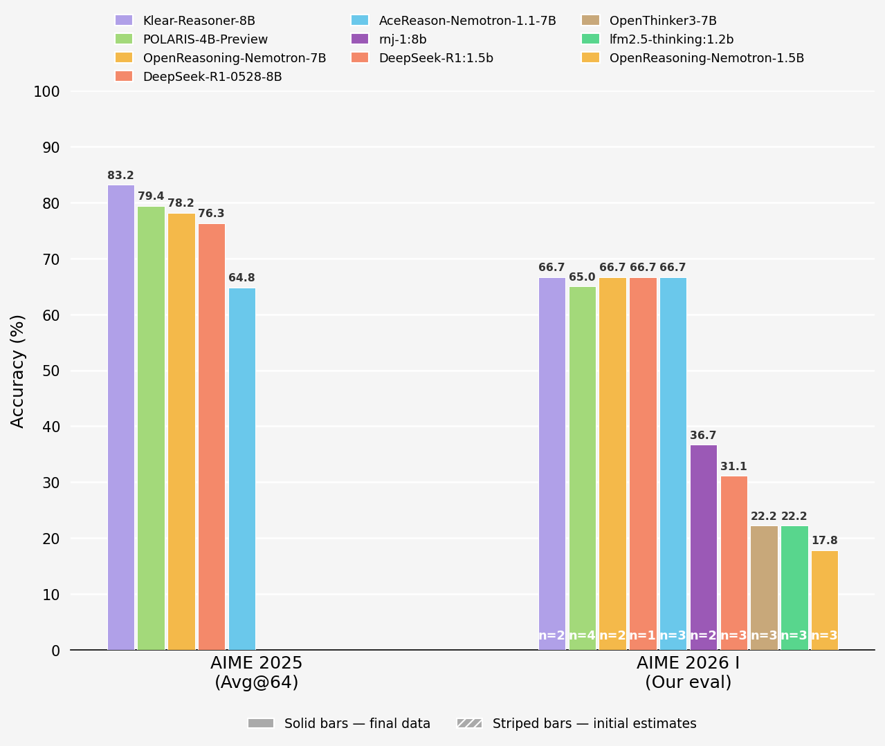
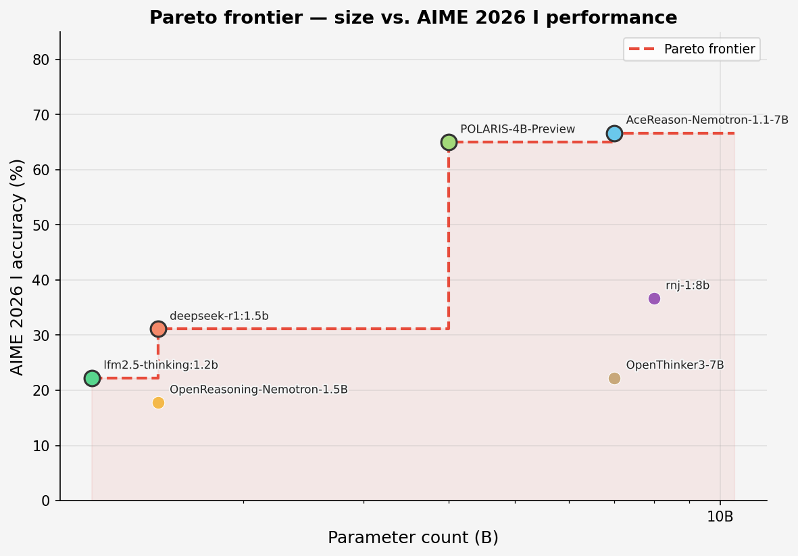

# Evaluation of small LLMs on the AIME 2026 I competition problems

## Overview

This repository evaluates a range of small open-weight language models (≤8B parameters) on the fifteen problems from the **2026 American Invitational Mathematics Examination I (AIME I)**. All evaluations are run locally using [Ollama](https://ollama.com) and the [Inspect AI](https://inspect.aisi.org.uk/) evaluation framework.

AIME is a prestigious mathematics competition aimed at the most mathematically talented secondary school students in the United States — roughly the top 5% of AMC qualifiers, or around 1 in 1,000 students nationally. Problems require multi-step reasoning spanning number theory, combinatorics, geometry, and algebra, with integer answers in the range 0–999. A score of 10/15 would place a student firmly among the strongest individual competitors. The fact that several models with just 4–8 billion parameters can consistently achieve this level of performance is remarkable.

Our results are consistent with, and in several cases directly verify, the benchmark scores reported by the model authors on AIME 2025 — providing independent confirmation using a fresh exam that none of these models could have trained on.

---

## Results

### AIME 2026 I (this work)

| Model | Params | Runs | Mean score | Accuracy |
|---|---|---|---|---|
| AceReason-Nemotron-1.1-7B | 7B | 3 | 10.0 / 15 | **66.7%** |
| POLARIS-4B-Preview | 4B | 4 | 9.7 / 15 | **65.0%** |
| rnj-1:8b | 8B | 2 | 5.5 / 15 | 36.7% |
| DeepSeek-R1:1.5b | 1.5B | 3 | 4.7 / 15 | 31.1% |
| lfm2.5-thinking:1.2b | 1.2B | 3 | 3.3 / 15 | 22.2% |
| OpenThinker3-7B | 7B | 3 | 3.3 / 15 | 22.2% |
| OpenReasoning-Nemotron-1.5B | 1.5B | 3 | 2.7 / 15 | 17.8% |

Scores are averaged across multiple independent runs (single sample per problem per run). Evaluations for Klear-Reasoner-8B, OpenReasoning-Nemotron-7B, and DeepSeek-R1-0528-8B are in progress.

### Comparison with published AIME 2025 results

The chart below compares published AIME 2025 performance (Avg@64, from the Klear-Reasoner paper [[1]](#references)) against our independently measured AIME 2026 I scores. Striped bars are placeholders pending evaluation.



The two models present in both datasets validate well:

- **POLARIS-4B-Preview**: 79.4% on AIME 2025 (Avg@64) → 65.0% on AIME 2026 I. A modest drop consistent with the 2026 exam being unseen.
- **AceReason-Nemotron-1.1-7B**: 64.8% on AIME 2025 → 66.7% on AIME 2026 I. Remarkably consistent across exam years.

### Pareto frontier: accuracy vs. model size

POLARIS-4B-Preview is the standout efficiency result — near-top accuracy at half the parameter count of the 7–8B models, making it Pareto-dominant over every larger model tested.



---

## Models

| Model | Parameters | Paper |
|---|---|---|
| **Klear-Reasoner-8B** | 8B | CE-GPPO: Controlling Entropy via Gradient-Preserving Clipping Policy Optimization [[1]](#references) |
| **POLARIS-4B-Preview** | 4B | [POLARIS-Project](https://huggingface.co/lucifers/Polaris-4B-Preview.Q8_0) (community model) |
| **AceReason-Nemotron-1.1-7B** | 7B | AceReason-Nemotron 1.1: Advancing Math and Code Reasoning through SFT and RL Synergy [[2]](#references) |
| **OpenReasoning-Nemotron** (1.5B / 7B) | 1.5B / 7B | AIMO-2 Winning Solution / OpenCodeReasoning [[3]](#references) |
| **OpenThinker3-7B** | 7B | OpenThoughts: Data Recipes for Reasoning Models [[4]](#references) |
| **DeepSeek-R1:1.5b** | 1.5B | DeepSeek-R1: Incentivizing Reasoning Capability in LLMs via RL [[5]](#references) |
| **DeepSeek-R1-0528-8B** | 8B | DeepSeek-R1: Incentivizing Reasoning Capability in LLMs via RL [[5]](#references) |
| **lfm2.5-thinking:1.2b** | 1.2B | [Liquid Foundation Models](https://www.liquid.ai/liquid-foundation-models) |
| **rnj-1:8b** | 8B | Community model |

---

## Methodology

- **Problems**: all 15 problems from the 2026 AIME I, scraped from the [Art of Problem Solving wiki](https://artofproblemsolving.com/wiki/index.php/2026_AIME_I).
- **Prompt**: zero-shot — the model is asked to think step by step and output `ANSWER: <integer>`.
- **Answer extraction**: primary match on `ANSWER: <integer>`; fallback to the last integer in [0, 999] in the response.
- **Context window**: 32,768 tokens, set at the Ollama model level to accommodate full chain-of-thought reasoning.
- **Concurrency**: one problem at a time (`max_connections=1`) so each problem gets the full GPU budget.
- **Multiple runs**: each model is evaluated 3–4 times to estimate variance.
- **Hardware**: single consumer GPU, local Ollama inference.

> **Note on comparability with published results**: published benchmarks (e.g. Avg@64) average over 64 independent generations per problem using pass@k-style aggregation. Our runs use a single generation per problem, then average across runs. Our variance is therefore higher and scores are not directly numerically comparable, but the overall ranking is representative.

---

## Setup and usage

**Requirements:** Python 3.12+, [Ollama](https://ollama.com/), [uv](https://github.com/astral-sh/uv) (recommended)

```bash
# Install dependencies
uv pip install inspect-ai requests beautifulsoup4 pyyaml python-dotenv matplotlib google-genai

# Copy and fill in API keys (only needed for cloud models)
cp .env.example .env

# Run the full evaluation pipeline
python main.py

# Regenerate charts
python src/plot_comparison.py
python src/plot_pareto.py
python src/plot.py
```

`main.py` will automatically pull models via Ollama (with HuggingFace fallback + GGUF conversion for models not in the Ollama registry), run the evaluation, and skip models that already have a successful result in `results/`.

---

## References

1. Xu, Z. et al. **Klear-Reasoner: Advancing Reasoning Capability via Gradient-Preserving Clipping Policy Optimization.** arXiv:2508.07629 (2025). https://arxiv.org/abs/2508.07629

2. Chen, Y. et al. **AceReason-Nemotron 1.1: Advancing Math and Code Reasoning through SFT and RL Synergy.** arXiv:2506.13284 (2025). https://arxiv.org/abs/2506.13284

3. Moshkov, I. et al. **AIMO-2 Winning Solution: Building State-of-the-Art Mathematical Reasoning Models with OpenMathReasoning dataset.** arXiv:2504.16891 (2025). https://arxiv.org/abs/2504.16891

4. Muennighoff, N. et al. **OpenThoughts: Data Recipes for Reasoning Models.** arXiv:2506.04178 (2025). https://arxiv.org/abs/2506.04178

5. DeepSeek-AI. **DeepSeek-R1: Incentivizing Reasoning Capability in LLMs via Reinforcement Learning.** arXiv:2501.12948 (2025). https://arxiv.org/abs/2501.12948
